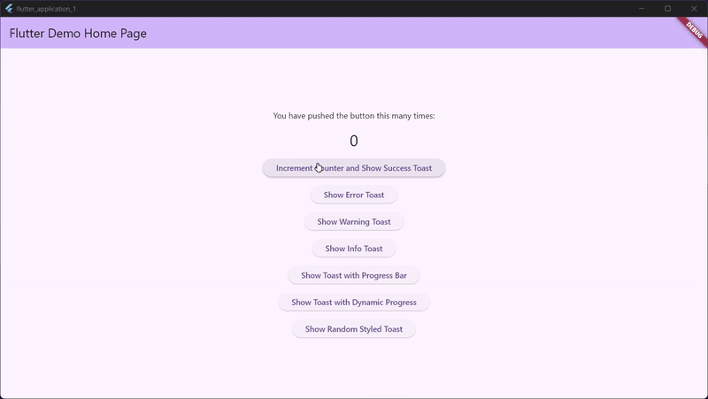

# Hz Toast

A highly customizable and feature-rich toast notification package for Flutter applications. Display beautiful, animated toast messages with various types, styles, and interactive features.

## Demo

<div align="center">



_Hz Toast in action - showcasing various toast types, animations, and customization options_

</div>

## Features

- 🎨 **Multiple Toast Types**: Error, Success, Warning, and Info with predefined color schemes
- 🎭 **Fully Customizable**: Colors, icons, decorations, padding, margins, and more
- ⏱️ **Auto-hide with Progress Bar**: Optional progress bar showing remaining time
- 🔄 **Dynamic Updates**: Update toast content while it's displayed
- 📱 **Responsive**: Adapts to different screen sizes with configurable max width
- ✨ **Smooth Animations**: Beautiful slide and fade animations
- 🖱️ **Interactive**: Clickable toasts with custom tap handlers
- 🎯 **Positioned**: Top-right positioned toasts that stack properly
- 🎛️ **Builder Pattern**: Custom builders for title, icons, and close buttons
- 🔧 **Easy Integration**: Simple overlay setup with minimal configuration

## Getting Started

Add this to your package's `pubspec.yaml` file:

```yaml
dependencies:
  hz_toast: ^0.0.3
```

Then run:

```bash
flutter pub get
```

## Setup

To use Hz Toast, you need to add the `HzToastWidget` to your app's overlay. This is typically done in your main app widget:

```dart
import 'package:flutter/material.dart';
import 'package:hz_toast/hz_toast.dart';

class MyApp extends StatelessWidget {
  const MyApp({super.key});

  @override
  Widget build(BuildContext context) {
    return MaterialApp(
      title: 'Your App',
      theme: ThemeData(colorScheme: ColorScheme.fromSeed(seedColor: Colors.deepPurple)),
      home: const MyHomePage(),
      builder: (context, child) {
        return Material(
          child: Overlay(
            initialEntries: [
              OverlayEntry(builder: (context) => child!),
              // Add the HzToastWidget to the overlay
              OverlayEntry(builder: (context) => const HzToastWidget()),
            ],
          ),
        );
      },
    );
  }
}
```

## Basic Usage

### Simple Toast

```dart
// Show a success toast
HzToast.show(HzToastData(
  'Operation completed successfully!',
  type: HzToastType.success,
));

// Show an error toast
HzToast.show(HzToastData(
  'An error occurred!',
  type: HzToastType.error,
));

// Show a warning toast
HzToast.show(HzToastData(
  'This is a warning message!',
  type: HzToastType.warning,
));

// Show an info toast
HzToast.show(HzToastData(
  'Here\'s some information.',
  type: HzToastType.info,
));
```

### Toast with Progress Bar

```dart
HzToast.show(HzToastData(
  'Processing your request...',
  type: HzToastType.info,
  duration: const Duration(seconds: 5),
  showProgressBar: true,
));
```

### Custom Styled Toast

```dart
HzToast.show(HzToastData(
  'Custom styled toast!',
  backgroundColor: Colors.purple,
  textColor: Colors.yellow,
  iconColor: Colors.yellow,
  padding: const EdgeInsets.all(16),
  margin: const EdgeInsets.only(right: 8, bottom: 16),
  borderRadius: BorderRadius.circular(16),
  titleBuilder: (title, color) {
    return Text.rich(TextSpan(
      text: '🔥 ',
      children: [
        TextSpan(
          text: title,
          style: TextStyle(
            fontWeight: FontWeight.w700,
            color: color,
          ),
        ),
        const TextSpan(text: ' 🔥'),
      ],
    ));
  },
));
```

## Advanced Usage

### Dynamic Toast Updates

You can update a toast's content while it's being displayed:

```dart
void showProgressToast() async {
  final id = UniqueKey().toString();
  ValueNotifier<int> progress = ValueNotifier<int>(0);

  final result = HzToast.show(HzToastData(
    'Processing...',
    id: id,
    type: HzToastType.info,
    autoHide: false,
    clickable: false,
    showCloseIcon: false,
    titleBuilder: (title, color) {
      return ValueListenableBuilder<int>(
        valueListenable: progress,
        builder: (context, value, child) {
          return Text(
            '$title (${value.toStringAsFixed(0)}%)',
            style: TextStyle(
              fontWeight: FontWeight.w500,
              color: color,
            ),
          );
        },
      );
    },
  ));

  if (result) {
    // Simulate progress
    for (int i = 1; i <= 100; i++) {
      await Future.delayed(const Duration(milliseconds: 80));
      progress.value = i;
    }

    // Update to completion state
    HzToast.update(id, HzToastData('Completed!', type: HzToastType.success));
    HzToast.hideIn(id, const Duration(seconds: 1));
  }

  progress.dispose();
}
```

### Handling Toast Events

```dart
HzToast.show(HzToastData(
  'Tap me!',
  type: HzToastType.info,
  clickable: true,
  onTap: () {
    print('Toast was tapped!');
    // Perform some action
  },
  onClose: () {
    print('Toast was closed!');
    // Cleanup or additional logic
  },
));
```

## HzToastData Properties

| Property          | Type          | Default                | Description                                         |
| ----------------- | ------------- | ---------------------- | --------------------------------------------------- |
| `message`         | `String`      | required               | The text message to display                         |
| `id`              | `String?`     | auto-generated         | Unique identifier for the toast                     |
| `type`            | `HzToastType` | `HzToastType.error`    | Toast type (error, success, warning, info)          |
| `duration`        | `Duration`    | `Duration(seconds: 4)` | How long the toast stays visible                    |
| `autoHide`        | `bool`        | `true`                 | Whether the toast should auto-hide                  |
| `clickable`       | `bool`        | `true`                 | Whether the toast responds to taps                  |
| `maxWidth`        | `double`      | `0.8`                  | Maximum width as fraction of screen width (0.0-1.0) |
| `showIcon`        | `bool`        | `true`                 | Whether to show the type icon                       |
| `showCloseIcon`   | `bool`        | `true`                 | Whether to show the close button                    |
| `showProgressBar` | `bool`        | `false`                | Whether to show progress bar for auto-hide          |

### Styling Properties

| Property           | Type                    | Description                               |
| ------------------ | ----------------------- | ----------------------------------------- |
| `backgroundColor`  | `Color?`                | Background color of the toast             |
| `textColor`        | `Color?`                | Color of the message text                 |
| `iconColor`        | `Color?`                | Color of the main icon                    |
| `closeIconColor`   | `Color?`                | Color of the close icon                   |
| `progressBarColor` | `Color?`                | Color of the progress bar                 |
| `decoration`       | `BoxDecoration?`        | Custom decoration for the toast container |
| `borderRadius`     | `BorderRadiusGeometry?` | Border radius of the toast                |
| `padding`          | `EdgeInsetsGeometry?`   | Internal padding                          |
| `margin`           | `EdgeInsetsGeometry?`   | External margin                           |
| `spacing`          | `double?`               | Spacing between toast elements            |

### Builder Properties

| Property           | Type                              | Description                       |
| ------------------ | --------------------------------- | --------------------------------- |
| `titleBuilder`     | `Widget Function(String, Color)?` | Custom builder for the title text |
| `iconBuilder`      | `Widget Function(Color)?`         | Custom builder for the main icon  |
| `closeIconBuilder` | `Widget Function(Color)?`         | Custom builder for the close icon |

## HzToast Methods

| Method                                   | Description                           |
| ---------------------------------------- | ------------------------------------- |
| `HzToast.show(HzToastData)`              | Show a new toast                      |
| `HzToast.update(String id, HzToastData)` | Update an existing toast              |
| `HzToast.hide(String id)`                | Hide a specific toast                 |
| `HzToast.hideIn(String id, Duration)`    | Hide a toast after a delay            |
| `HzToast.hideAll()`                      | Hide all visible toasts               |
| `HzToast.exists(String id)`              | Check if a toast with given ID exists |

## Toast Types

The package includes four predefined toast types with their own color schemes:

- **`HzToastType.error`**: Red color scheme for error messages
- **`HzToastType.success`**: Green color scheme for success messages
- **`HzToastType.warning`**: Orange color scheme for warnings
- **`HzToastType.info`**: Blue color scheme for informational messages

Each type automatically sets appropriate colors for icons, text, and close buttons, but these can be overridden with custom colors.

## Contributing

Contributions are welcome! Please feel free to submit a Pull Request.

## License

This project is licensed under the MIT License - see the [LICENSE](LICENSE) file for details.
# hz_toast


